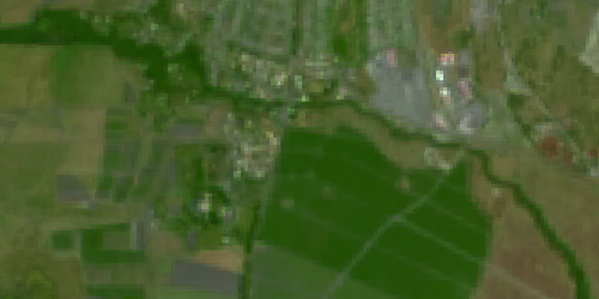

# Introduction

NASA has **the best** data.  Way better than NOAA.  Most visitors to nasa.gov websites are looking for images and videos.  The objective of this API is to make NASA data, especially imagery, emminently available.  

# Authentication

You do not need to authenticate in order to explore the NASA data.  However, if you will be intensively using the APIs to, say, support a mobile application, then you should sign up for an [api.data.gov developer key](https://api.data.gov/signup).  

## Web Service Rate Limits

Limits are placed on the number of API requests you may make using your API key. Rate limits may vary by service, but the defaults are:

- Hourly Limit: 1,000 requests per hour

For each API key, these limits are applied across all api.data.gov API requests. Exceeding these limits will lead to your API key being temporarily blocked from making further requests. The block will automatically be lifted by waiting an hour. If you need higher rate limits, contact us.

## DEMO_KEY Rate Limits
In documentation examples, the special DEMO_KEY api key is used. This API key can be used for initially exploring APIs prior to signing up, but it has much lower rate limits, so you're encouraged to signup for your own API key if you plan to use the API (signup is quick and easy). The rate limits for the DEMO_KEY are:

- Hourly Limit: 30 requests per IP address per hour
- Daily Limit: 50 requests per IP address per day

## How Do I See My Current Usage?

Your can check your current rate limit and usage details by inspecting the `X-RateLimit-Limit` and `X-RateLimit-Remaining` HTTP headers that are returned on every API response. For example, if an API has the default hourly limit of 1,000 request, after making 2 requests, you will receive these HTTP headers in the response of the second request.

> HTTP headers on API response

```shell
X-RateLimit-Limit: 1000
X-RateLimit-Remaining: 998
```

The hourly counters for your API key reset on a rolling basis.

**Example**: If you made 500 requests at 10:15AM and 500 requests at 10:25AM, your API key would become temporarily blocked. This temporary block of your API key would cease at 11:15AM, at which point you could make 500 requests. At 11:25AM, you could then make another 500 requests.


<aside class="notice">
Anyone can register for an api.data.gov key, which can be used to access data across federal agencies.
</aside>

# Earth

A recent industry [report](https://www.fgdc.gov/ngac/meetings/december-2014/ngac-landsat-economic-value-paper-2014-update.pdf) estimates that total annual value of $2.19 billion, far exceeding the multi-year total cost of building, launching, and managing Landsat satellites and sensors.  The value is derived from consumer *use* of the data.  There is no inherent value in idle data.  The objective of this endpoint is to unlock the significant public investment in earth observation data.  An open, well-documented, and simple API dramatically reduces the transaction costs, which are a significant barrier to engaging with information.  

Currently, we only support the Landsat 8 sensor.  To be explicit, the resource string identifier for supported resources are as follows.  Resources in parentheses indicate planned resources.

- `L8_TOA`
- `(L7_TOA)`

## Imagery

> Example JSON response

```json
[
  {
    "date": "2014-07-01T09:01:36.000",
    "url": "goog.le/img.html",
    "clouds": 0.01
  }
]
```
> Example image at returned URL

> 


This endpoint retrieves the link to the the image at the supplied location, date, and resource.  The response will include the date and URL to the image that is closest to the supplied date.    The requested resource may not be available for the *exact* date in the request. The parameters in bold are required, all others are optional.  

### HTTP Request

`GET http://api.nasa.gov/earth/imagery`

### Query Parameters

Parameter | Type | Default | Description
--------- | --------- | ------- | -----------
**lat** | **float** | n/a | **Latitude**
**lon** | **float** | n/a | **Longitude**
width | integer | 1000 | width in meters of returned image
height | integer | 1000 | height in meters of returned image
bandwidth | integer | 30 | number of days on either side of returned 
date | YYYY-MM-DD | None | date of image; if `None` supplied, then the most recent image is returned
resource | string | L8_TOA | resource indicators
cloud_calculation | bool | False | calculate the percentage of the image covered by clouds
api_key | string | DEMO_KEY | api.data.gov key for expanded usage

<aside class="notice">
Note that the returned object may not match the supplied date exactly.
</aside>

## Available resources

> Example JSON response

```json
[
  {
    "date": "2014-07-01T09:01:36.000",
    "resource": "Landsat8"
  },
  {
    "date": "2014-07-15T15:46:12.000",
    "resource": "Landsat8"
  },
  {
    "date": "2014-08-01T08:23:32.000",
    "resource": "Landsat8"
  }
]
```

This endpoint retrieves all dates of NASA earth imagery for the given resource and location.  The endpoint is helpful to determine available imagery, which can be queried in a spearate request to the [`imagery`](/#imagery) endpoint.

### HTTP Request

`GET http://api.nasa.gov/earth/dates`

### Query Parameters

Parameter | Type | Default | Description
--------- | --------- | ------- | -----------
**lat** | **float** | n/a | **Latitude**
**lon** | **float** | n/a | **Longitude**
resource | string | L8_TOA | resource indicators
api_key | string | DEMO_KEY | api.data.gov key for expanded usage


# Mars

NASA's Mars Exploration Rover Mission (MER) is an ongoing robotic space mission involving two rovers, Spirit (MER-A) and Opportunity (MER-B) exploring the planet Mars. It began in 2003 with the sending of the two rovers to explore the Martian surface and geology.  Likewise, Curiosity is a car-sized robotic rover exploring Gale Crater on Mars as part of NASA's Mars Science Laboratory mission (MSL).  What sort of imagery is retrieved from these three rovers?  This endpoint provides RESTful access to the images, so that you can explore the Martian landscape.

## Imagery

This endpoint returns images (or specifically the URLs of images) for the supplied date, rover, and instrument taken on Mars.  Images are only returned if the instrument exists on the specified rover. 

> Example JSON response

```json
[
  {
    "date": "2014-07-01T09:01:36.000",
    "url": "goog.le/img.html",
    "clouds": 0.01
  }
]
```
> Example image at returned URL

> 


### HTTP Request

`GET http://api.nasa.gov/mars/imagery`

### Query Parameters

Parameter | Type | Default | Description
--------- | --------- | ------- | -----------
**date** | **POSIX date** | n/a | **Retrieve all imagery from this day for the supplied rover.**
rover | string | msl | The rover
instrument | string | mastcam_right | 
joke | bool | False | Include the single joke image with Marvin the Martian in one, random Mars image
api_key | string | DEMO_KEY | api.data.gov key for expanded usage

<aside class="success">
If you find the image with Marvin the Martian contact the NASA open data team with the Image ID and we'll give you supreme praise.
</aside>


# APOD

One of the most popular websites at NASA is the [Astronomy Picture of the Day](http://apod.nasa.gov/apod/astropix.html). In fact, this website is one of the [most popular websites](https://analytics.usa.gov/demo/) across all federal agencies.  This endpoint structures the APOD images so that they can be repurposed for other applications.  In addition, it adds the ability to process the APOD explanation into core concepts using natural language processing and cross-referencing the text with large, online databases.  

> Example JSON response

```json
{
  "concept_tags": true,
  "title": "Interior View",
  "url": "http://apod.nasa.gov/apod/image/1501/15618296264_21bc1e368e_o1024.jpg",
  "explanation": "Some prefer windows, and these are the best available on board the International Space Station. Taken on January 4, this snapshot from inside the station's large, seven-window Cupola module also shows off a workstation for controlling Canadarm2. Used to grapple visiting cargo vehicles and assist astronauts during spacewalks, the robotic arm is just outside the window at the right. The Cupola itself is attached to the Earth-facing or nadir port of the station's Tranquility module, offering dynamic panoramas of our fair planet. Seen from the station's 90 minute long, 400 kilometer high orbit, Earth's bright limb is in view above center.",
  "concepts": [
    "International Space Station",
    "Mir",
    "Extra-vehicular activity",
    "STS-130",
    "Unity",
    "Planet",
    "Window",
    "Earth"
  ],
  "date": 2015-01-23
}
```
> Example image at returned URL

> 


### HTTP Request

`GET http://api.nasa.gov/apod`

### Query Parameters

Parameter | Type | Default | Description
--------- | --------- | ------- | -----------
date | YYYY-MM-DD | *today* | The date of the APOD image to retrieve
concept_tags | bool | False | Return an ordered dictionary of concepts from the APOD explanation
api_key | string | DEMO_KEY | api.data.gov key for expanded usage


# Patents

The NASA patent portfolio is available to benefit US citizens. Through partnerships and licensing agreements with industry, these patents ensure that NASA's investments in pioneering research find secondary uses that benefit the economy, create jobs, and improve quality of life.  This endpoint provides structured, searchable developer access to NASA's patents.

**Acceptable patent categories**

- materials_and_coatings
- sensors
- aeronautics
- health_medicine_biotechnology
- information_technology_software
- robotics_automation_control
- mechanical_fluid_systems
- electrical_electronics
- instrumentation
- optics
- power_generation_storage
- propulsion
- communications
- manufacturing
- environment

> Example JSON response

```json
{
  "count": 106,
  "results": [
    {
      "name": "Dan Hammer"
    },

    {
      "name": "Dan Hammer"
    }
  ]
}
```


### HTTP Request

`GET http://api.nasa.gov/patents`

### Query Parameters

Parameter | Type | Default | Description
--------- | --------- | ------- | -----------
**category** | **string** | n/a | **Patent category**
q | string | None | Search text to filter results
concept_tags | bool | False | Return an ordered dictionary of concepts from the patent abstract
api_key | string | DEMO_KEY | api.data.gov key for expanded usage

<aside class="notice">
The patent category must be from the acceptable category list or no results will be returned.
</aside>

# Surface temperature


> Example JSON response

```json
{
  "count": 5,
  "results": {
    "2010": 0.966000021,
    "2011": 1.236700058,
    "2012": 1.936300039,
    "2013": 0.373100013,
    "2014": -0.219600007
  }
}
```

## Address


### HTTP Request

`GET http://api.nasa.gov/temperature/address`

### Query Parameters

Parameter | Type | Default | Description
--------- | --------- | ------- | -----------
api_key | string | DEMO_KEY | api.data.gov key for expanded usage

## Coordinate point

### HTTP Request

`GET http://api.nasa.gov/temperature/coordinate`

### Query Parameters

Parameter | Type | Default | Description
--------- | --------- | ------- | -----------
api_key | string | DEMO_KEY | api.data.gov key for expanded usage


# Sounds

### HTTP Request

`GET http://api.nasa.gov/sounds`

### Query Parameters

Parameter | Type | Default | Description
--------- | --------- | ------- | -----------
api_key | string | DEMO_KEY | api.data.gov key for expanded usage
